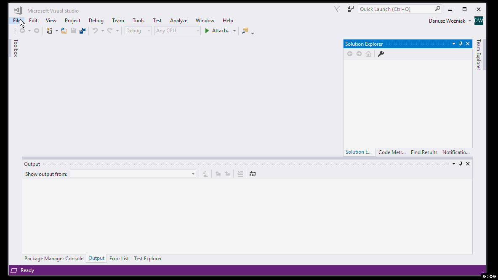

# Pierwsze kroki (1/4): Stworzenie projektów w Visual Studio

## Stworzenie projektów w Visual Studio

## Zobacz też:

- Następny krok (2/4): [Instalacja pakietów przez NuGet](1-install-packages-via-nuget.md)