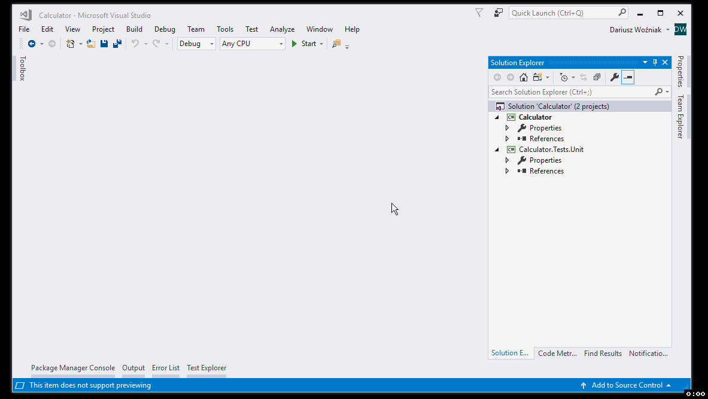
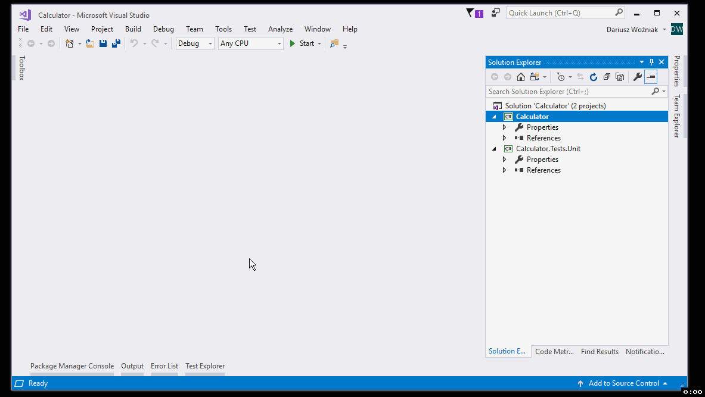

# Pierwsze kroki (2/4): Instalacja pakietów przez NuGet

## Metoda 1: Okno instalacji pakietów NuGet

## Metoda 2: Konsola NuGet Package Manager

## Zobacz też:

- Następny krok (3/4): [Pierwszy test jednostkowy](1-first-test.md)
- Poprzedni krok (1/4): [Stworzenie projektów w Visual Studio](0-setup.md)