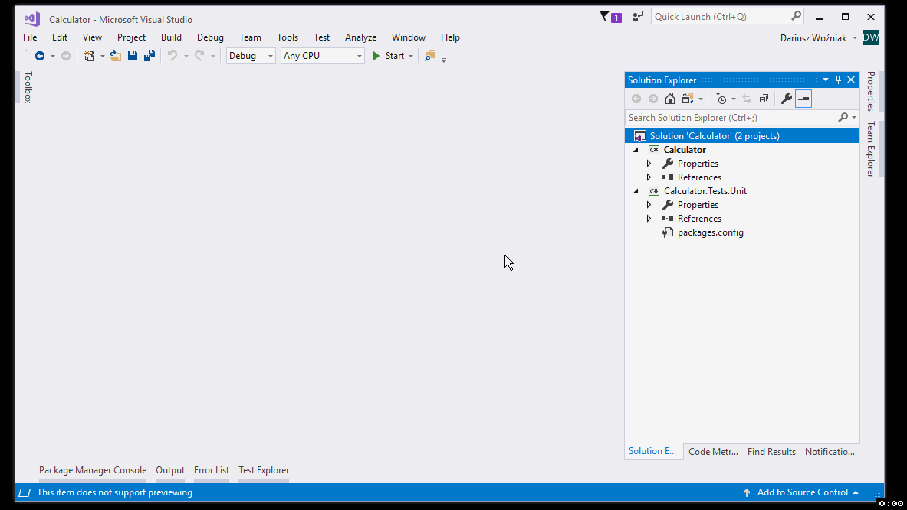

# Pierwsze kroki (3/4): Pierwszy test jednostkowy

## Metoda 1: Pierwszy test jednostkowy

## Metoda 2: Metoda zaawansowana (z użyciem ReSharpera)

## Zobacz też:

- Następny krok (4/4): [Właściwa implementacja](3-valid-implementation.md)
- Poprzedni krok (2/4): [Instalacja pakietów przez NuGet](1-install-packages-via-nuget.md)